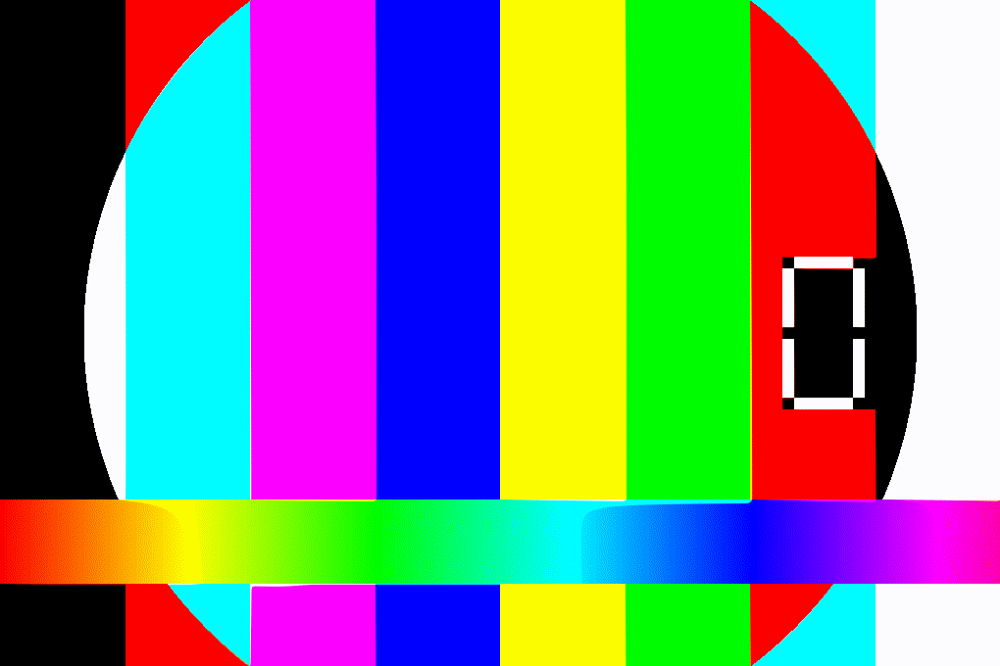

# 📅 Calendar App — Electron


**One command to run:** `npm start` — clean Month view, zero config, data survives reinstalls.



### ✨ Why this calendar?

- **Recurrence that just works** — `none / daily / weekly (multi-weekday) / monthly / yearly` with end-date or forever, clamped to month length (Jan 31 → Feb 28)
- **Color Types** — `Work / Personal / Other` by default; create, **rename & recolor inline**, delete → falls back to Other
- **Instant Search** — filter grid & day pane as you type (`/` to focus, `Esc` to clear)
- **Google-Calendar style sidebar** — click to hide/show types, remembered
- **Keyboard first** — `←↑↓→` move, `Enter` add, `N` new, `T` today, `PgUp/PgDn` month, `/` search
- **Safe storage** — `events.json`/`types.json` in `app.getPath('userData')` (not beside app) + auto-migration

---

### 🚀 Quick Start

```bash
git clone https://github.com/sempervivum-burningstar/calendar-app
cd calendar-app
npm install
npm start
# or npm test  → 35 recurrence tests
```

> Requires Node.js 18+. Data path shown in sidebar footer.

### 🎮 Tour

| Action | How |
|--------|-----|
| Select day | Click cell |
| Add event | Double-click day · `Enter` · `+ New event` |
| Edit | Pencil icon or double-click event |
| Search | Type in top bar or press `/` |
| Toggle type | Click left sidebar chip |
| Edit types | `Manage…` → color picker / rename inline |

### 🧩 Structure

| File | Purpose |
|------|---------|
| `main.js` | Electron main, `userData` persistence + migration |
| `preload.js` | Safe IPC bridge |
| `recurrence.js` | Recurrence engine (shared with tests) |
| `renderer.js` | UI + search + editable types |
| `index.html` | Layout & dialogs |

---

### 🌟 Love it? Star it & share

- ⭐ Star this repo — helps others discover it
- 🐦 Tweet: “Found a minimal keyboard-driven Electron calendar with weekly multi-day repeats and instant search — `npm start` and go! https://github.com/sempervivum-burningstar/calendar-app”
- 💬 Post to `r/electron`, `r/javascript`, Dev.to with GIF demo
- 🤝 PRs / Issues welcome — see `CONTRIBUTING.md`

---

Built with Electron • Catppuccin-inspired dark theme
